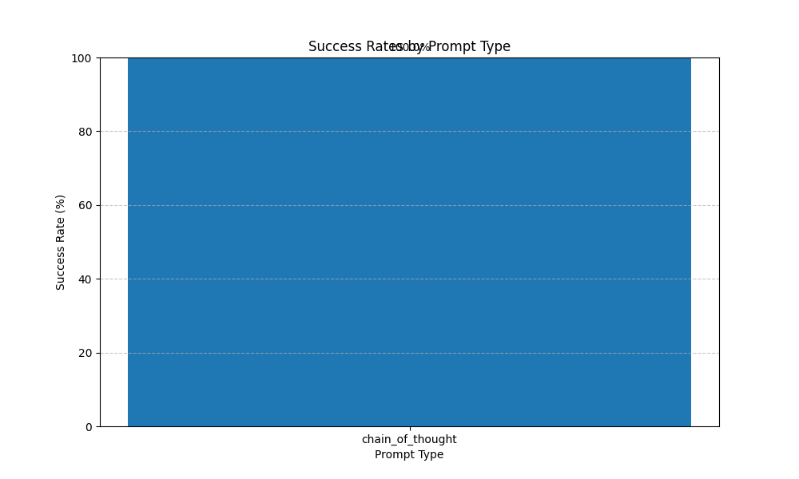

# Enhanced SED Puzzle Solver Evaluation Report

## Overall Success Rates

## Detailed Success Metrics

| Prompt Type | Total | Correct | Success Rate | First Attempt | Retry Success |
|------------|-------|---------|--------------|---------------|---------------|
| chain_of_thought | 5 | 5 | 100.0% | 80.0% | 100.0% |

## Retry Effectiveness

The following chart shows the improvement in success rate achieved by the retry mechanism:

## Failure Analysis

### chain_of_thought Failure Distribution

Total failures: 0

| Failure Type | Count | Percentage |
|-------------|-------|------------|
| parse_failure | 0 | 0.0% |
| state_tracking_error | 0 | 0.0% |
| invalid_rule_index | 0 | 0.0% |
| incomplete_solution | 0 | 0.0% |
| other_failure | 0 | 0.0% |

## Recommendations

### Key Focus Areas for Improvement

1. **Enhance Output Format Instructions**
   - Make output format requirements more prominent in prompts
   - Add explicit examples of correctly formatted solutions
   - Implement more robust parsing of model outputs

The **chain_of_thought** prompting strategy shows the best performance with a 100.0% success rate and should be prioritized.

The retry mechanism improved success rates by an average of 20.0%. This substantial improvement suggests that further refining the retry feedback could yield even better results.

